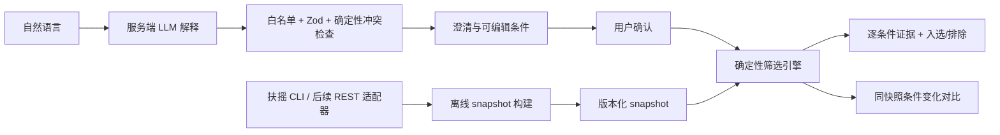

# 收尾执行计划（2026-09-29）

目标：提交可操作的真实数据 Web URL、源码仓库、README、AI 使用与验证记录和测试说明。只有线上主链路验收通过才视为最终交付。

截至2026-09-29：真实数据产品已在[公网](https://stock-intent.vercel.app)发布；DeepSeek真实非预设意图、真实快照筛选和浏览器完整链路均已在线通过。29项自动测试、lint、typecheck、build通过。已有本地Git提交和无密钥源码包，远端仓库尚未建立。

1. **修正核心行为**：严格识别完整预设；额外要求交给模型或明确报告未配置；展示假设、unsupported、冲突；编辑描述后旧条件失效；筛选结果绑定实际快照元数据。
2. **完成异常验证**：实际请求字节限制、模型错误与敏感信息隔离、快照损坏/不完整与失败刷新保留旧版；运行 lint/typecheck/test/build 和 Playwright。
3. **整理源码交付**：README与验证记录同步实测；交付文件只含源码和配置模板，不含密钥、真实快照、原始响应、环境文件或截图中的敏感信息；建立远端仓库。
4. **真实模型及上线验收**：确认模型密钥供应商与使用端点后，仅配置服务器 Secret；明确真实数据展示方式后发布；线上复测非预设输入、编辑、筛选、证据、缺失数据与敏感性。

密钥原则：不提交、不打包、不放 NEXT_PUBLIC_*、不进入浏览器响应或日志。评审通过环境变量配置自己的凭据。金融取数凭据只用于本地构建快照，Web筛选无需它。

产品方向为真实数据版。用户已明确批准将规范化快照上传至Vercel并公开展示；原始响应与源码仓库分离。DeepSeek生产Secret已配置。远端源码仓库仍缺少可调用的创建入口或Git凭据；本地Git提交与源码包已准备好。

以下为基础阶段的设计记录；完成状态以当前测试说明及实测为准。

---

# 自然语言智能选股与策略解释器：24小时实施计划

更新：2026-09-28。阶段：基础工程；尚未完成可交付的完整选股产品。

## 1. 产品目标与范围

目标用户是能够表达投资研究意图、但不熟悉指标字段与筛选语法的个人研究者。用户描述 → 必要澄清 → 明示默认假设 → 可编辑条件 → 用户确认 → 确定性筛选 → 入选/排除证据 → 同快照修改对比 → 保存条件。

首版只有沪深300、7个白名单指标、AND组合和3个核心页面。初始预设按题目给定：营收同比≥10%、净利润同比≥10%、0<PE TTM≤30、60日年化波动率≤30%。预设不构成客观定义；“经营改善”在这里仅指增长达标，不声称增长正在加速。用户修改阈值、运算符、增加或删除条件后，以完整新条件重新执行。

保存条件到浏览器本地，作为题目要求的后续动作。暂不做历史回测、监控、自动交易、持仓画像、全A股、行业相对估值、复杂OR逻辑或多代理。当前成分和最新财务不具备历史时点回测所需的数据基础。

## 2. 架构与职责



- LLM 只返回受约束的意图对象；不接受它输出的股票名单、指标值或PASS/FAIL。用于语言映射与澄清的能力目前未接入。
- 规则引擎负责比较、冲突、计数、集合差分；解释主干从证据模板生成，AI可选地润色文字，不得改数字。
- 金融层只提供事实；维护脚本与Web运行时隔离。用户每次筛选的金融API调用次数为0。
- 推荐 Next.js App Router + TypeScript strict + Zod 4 + Node脚本；首版JSON快照足以容纳300只股票。暂不引入数据库、队列或复杂Agent框架。
- 依赖安装结果由 package-lock.json 锁定。依据：[Next.js安装文档](https://nextjs.org/docs/app/getting-started/installation)、[Zod API](https://zod.dev/api)。

## 3. 当前目录与后续文件

```text
stock-intent/
  src/app/                  # 三页基础壳、layout、样式
    page.tsx                # Intent Builder
    results/page.tsx
    sensitivity/page.tsx
    api/health/route.ts     # 只证明基础服务可用
  src/components/           # AppShell、DataStatus、EmptyState
  src/domain/
    metrics.ts              # 唯一指标白名单、标签、单位
    schemas.ts              # 严格领域模型与一致性约束
    presets.ts              # 用户给定预设；不是AI输出
  src/lib/finance/
    cli.ts                  # 安全调用已安装CLI，捕获原始证据
    numeric.ts              # 严格解析供应商数字
    volatility.ts           # 验证所需的确定性波动率计算
  scripts/
    verify-finance.ts       # 小样本真实数据验证及离线重放
    build-market-snapshot.ts # 当前仅--plan；--execute明确失败
  tests/domain.test.ts      # 合成单元测试，绝不展示为真实数据
  data/verification/        # 本机真实响应和SHA256清单，Git忽略
  data/snapshots/           # 后续创建，Git忽略
  artifacts/               # 本地截图与检查日志，Git忽略
  docs/DATA_VERIFICATION.md
  docs/TEST_PLAN.md
  docs/AI_USAGE.md
  IMPLEMENTATION_PLAN.md
  README.md
```

下一阶段优先创建：

1. `src/lib/finance/provider-schemas.ts`、`normalizers.ts`：核对收入/利润口径，保留原字段与原值，记录银行毛利率不适用。
2. `src/lib/snapshot/build.ts`、`store.ts`：完整构建、断点缓存、质量报告、原子发布、只读加载；将脚本从plan扩为真实执行。
3. `src/domain/conflicts.ts`、`screen.ts`、`sensitivity.ts`：边界求交、三态判断、同快照差分。
4. `src/lib/ai/interpret.ts`、`prompts.ts`、`src/app/api/intent/route.ts`：真实LLM解析及schema拒绝路径。
5. `src/app/api/screen/route.ts`、`src/app/api/sensitivity/route.ts`：只调用快照及规则引擎，校验请求体。
6. `src/components/intent/*`、`results/*`、`sensitivity/*`：替换页面空状态并完成保存条件。

这些文件是计划项，目前没有用成功响应的空实现冒充已完成接口。

## 4. 数据模型及计算约定

核心定义已落在 `src/domain/schemas.ts`，类型由 `z.infer`导出。

| 模型 | 核心字段与额外约束 |
|---|---|
| NaturalLanguageIntent | original_query、CSI300、AND、conditions、assumptions、unsupported_requests、conflicts、needs_clarification；条件ID唯一，引用必须存在 |
| Condition | id、source_phrase、category、metric、metric_label、operator、threshold、unit、explanation、editable、origin；标签/单位/类别须匹配白名单 |
| StockMetric | 股票身份、metric、value或null、unit、source、endpoint、as_of、as_of_semantics、retrieved_at、report_period、calculation_method、raw_fields、raw_references、quality、issues、复权与窗口 |
| ScreeningResult | stock、status、passed(boolean或null)、condition_results、failed_condition_count、unknown_condition_count；与逐项结果一致 |
| MarketSnapshot | 版本、mode(real/demo)、构建时间、市场日期、统一财报期、成分证据、全量成员、每股7项指标、ready/partial/blocked |
| ScreeningRun | snapshot_id、条件哈希、完整意图、逐股结果、执行时间 |
| SensitivityResult | 同一snapshot_id、前后运行、前后数量、新增/剔除、未知数量；集合互斥且计数守恒 |

所有领域输入使用strict对象，拒绝额外字段、隐式字符串转数值、NaN、Infinity。供应商原始响应由独立适配器解析，新增字段留在原始证据中，不自动进入指标白名单。模型校验不能替代规则引擎：服务端不接收客户端提交的判定或计数。

数值内部统一采用**百分数值**：10表示10%，30表示30%；PE/PB是倍数。展示时可四舍五入，筛选用未舍入值。

波动率先计算比例收益率 `r[t]=close[t]/close[t-1]-1`，再 `sample_std(r[-60:]) * sqrt(252) * 100` 写入百分数字段，ddof=1。需要**61个连续市场交易日**前复权收盘价；停牌缺口、重复日期、非正价格、不足样本均不填充，返回缺失或冲突。不会使用“最近60个价格”计算60个收益率。

三态聚合：有FAIL则股票为FAIL；无FAIL但有UNKNOWN则为UNKNOWN；全部PASS才入选。UNKNOWN不是零失败的“最接近入选”。排除页将数据完整的FAIL股票按失败项数升序、证券代码作稳定次序；含UNKNOWN的股票单列。

同指标条件冲突由程序求区间交集，包括严格/非严格边界；PE>30与PE≤20属于硬冲突。无候选不等于条件冲突。OR、走势加速等超出范围的表达返回unsupported，需用户明确处理后才能运行。

## 5. 实测驱动的数据构建方案

### 已发现的合同差异

2026-09-28真实小样本请求成功，但`financials.indicators`没有原样返回两个白名单同比字段。实际返回：

- `calculate_operating_income_yoy_growth_ratio`
- `calculate_parent_holder_net_profit_yoy_growth_ratio`

后者是归母净利润同比，不能改名为合并净利润同比。已额外取得3只样本各8期合并利润表，其中有`operating_income`、`net_profit`、`parent_holder_net_profit`及本期/上年同期行。

**推荐解决路线：**保留产品白名单不变；程序从经核验的同口径合并利润表计算营收与净利润同比。先核对quarterly指报告期末累计还是单季、同一版本及重述口径，再按`(本期/上年同期-1)*100`计算。首版上年同期≤0时返回不可比/UNKNOWN，不用绝对值分母偷偷制造“改善”。收入别名可以交叉核对，但未经验证不直接映射。最终映射与公式要写在证据里。

发现部分上年同期行与本期行的`report_date_ms`相同，可能是当前报告中的比较期或重述数据；**尚未确认其语义**。原值保留，不能当成历史首次披露日期，更不能用于历史时点回测。

### 构建步骤

1. 查询解析沪深300，获取成分，冻结股票池版本；检查300只唯一成员，不用硬编码个股替代数据源。
2. 获取近一年交易日历，冻结一个已收盘市场日与显式报告期。本轮验证为2026-2，后续CLI应要求指定或通过已验证规则选择，不写死“最新”。盘中不纳入未完成日K。
3. 单股财务指标获取ROE/毛利率；统一报告期，不将缺失公司悄悄回退到上一季度。增长指标按上面的口径门槛单独实现。
4. 估值每批≤100只，300只需3批；对请求集合与返回集合做差，遗漏股票记录missing。
5. 历史行情先检查可用本地覆盖或缓存；否则按每股有界窗口获取，禁止全市场多年下载。请求约120–180自然日并校验最后61个交易日，必要时有界扩窗。
6. 算波动率并构建7项指标证据，保留每个原始响应、请求参数、取数时间、原字段和SHA256。财务报告期、披露时间、取数时间、市场日分别存储。
7. 请求并发初始2，估值按100批量；限流/网络/5xx最多3次指数退避并加抖动。参数/认证错误不重试；避免与CLI内部重试叠加。每端点设超时和总体预算。
8. 缓存键为端点+规范化参数+契约版本。复用只限满足当前股票池/市场日/报告期的原始数据；增量更新不得混用旧前复权基准。
9. 全部成分必须保留；每股7项完整键集合，不可用项value=null且带原因。银行毛利率允许missing，快照可partial，筛选只依赖当前条件使用的指标。snapshot质量状态不是候选判断。
10. 写入不可变版本文件、manifest、质量报告；通过schema和覆盖检查后原子切换`current.json`。构建失败保留上一版本并标注真实时间，不覆盖为“新鲜”。

冷启动约606次请求（搜索1+成分1+日历1+财务300+估值3+历史300）；若每股补一请求取利润表则约906次，均在构建阶段。没有假设不存在的批量财务接口。每次用户筛选仅扫描本地约300×条件数条记录。

### 时点与新鲜度

- 财务指标接口无披露时间：`as_of=null`并显示“供应商未提供”，另显示明确报告期和取数时间；禁止用取数时间代替披露日。
- 估值时间是批次上游元数据最大值，标记`upstream_batch_max`；逐字段时点和MRQ具体期末未知，显示未知。不能伪装为所有指标同步。
- K线要求覆盖冻结市场日；少一个交易日即为该指标stale/missing，不自动沿用旧波动率。
- 财务按报告期校验，估值按交易日与返回元数据检查。新鲜度阈值属于显式产品政策，记录版本；未知时点单独提示，不能给“实时/全部最新”标签。
- demo如后续需要，独立路径、mode=demo、持续可见标识；当前工程没有demo股票数据。

## 6. 三个页面的组件结构

共享：`AppShell > Navigation / DataStatusBanner / ComplianceFooter`。桌面端优先，表格和条件占主要空间；来源、报告期和时点可直接查看，不藏在无提示的图标中。

```text
IntentBuilderPage
  QueryInput
  InterpretationPanel
    AssumptionNotice + ClarificationPanel
    UnsupportedRequestList + ConflictBanner
    ConditionEditorList
      ConditionRow(metric / operator / threshold / unit / delete)
      AddCondition(仅白名单)
  ConfirmAndRunButton

ResultsPage
  SnapshotContext(股票池 / 市场日 / 财报期 / version / 质量)
  ResultSummary(总数 / PASS / FAIL / UNKNOWN)
  CandidateTable
    StockEvidenceDrawer
      ConditionEvidenceRow(判断 / 实际值 / 阈值 / 来源 / 时点 / 报告期 / 口径)
  SaveConditionsButton(浏览器本地，不存持仓)

ExcludedSensitivityPage
  BaselineSummary(冻结snapshot与原条件)
  ConditionEditorList
  CountDelta + AddedRemovedTables
  NearMissTable(失败项数升序，稳定次序)
  UnknownDataTable(不冒充接近入选)
```

状态必须覆盖：未输入、解析中、需澄清、不支持、冲突、服务失败、数据未就绪、运行中、空结果、部分缺失、成功。修改后保留原基线并标记结果待重新执行；差分不允许跨snapshot，数据刷新需重新建立基线。

## 7. 24小时排期与退出条件

以下为整个assignment的时间预算，T0由实际开工时间确定，不声称计时已开始。

| 时间 | 工作 | 验收门槛 |
|---|---|---|
| 0–2h | 环境、真实链路、基础工程、schema和范围 | 本轮产物；明确字段差异；lint/typecheck/build |
| 2–5h | 解决增长口径，snapshot构建与质量报告 | 300成员均有记录；异常不填充；7项指标证据可追溯 |
| 5–8h | 比较引擎、冲突检查、三态、差分 | 纯函数测试通过；同数据同条件同结果；同快照对比 |
| 8–11h | 真实LLM意图解析、澄清与白名单约束 | 模型幻觉字段被拒；数字不由模型生成；用户可确认 |
| 11–16h | 三页真实交互、编辑、证据、保存条件 | 一条完整用户任务可实际操作；空结果/未知可解释 |
| 16–19h | 集成、异常、合规、提示注入测试 | API失败不返回假成功；服务端凭据不进浏览器 |
| 19–22h | 部署与外网冒烟、文档及验证记录 | 可公开访问URL、仓库和README；检查金融数据展示权限 |
| 22–24h | 修复、人工核验、可选60–180秒演示 | 交付清单完整，保留缓冲；演示不替代真实功能 |

若时间吃紧，保留主链路和证据，削减动画、复杂排序、批量解释、视频，不削减真实数据、编辑能力、缺失提示或可运行性。

## 8. 当前阻塞与决策

- 基础工程无凭据或依赖阻塞；扶摇认证及小样本远端能力已实测成功。
- 增长指标的供应商字段与白名单不一致；全量构建前必须完成语义核验及确定性派生适配。不是让用户重新提供金融Key的问题。
- LLM供应商/模型、服务端凭据、托管平台和代码仓库目标尚未配置或验证。基础壳不依赖这些配置；完整产品需要。
- 全量300只覆盖、持续限流、全量耗时、缓存恢复、历史财报真实性交叉核验仍未完成，不将小样本成功推定为全量成功。
- 公开展示权限、部署环境的数据存放与刷新方式需在发布阶段核实。原始API响应不提交公开仓库。

## 9. 安全与合规验收

固定展示“本工具用于研究与筛选条件解释，不构成投资建议。”不做确定性涨跌预测、收益承诺、直接买卖建议或自动交易。自然语言是待解析数据，不能覆盖系统规则；提示注入请求不能访问凭据、工具或改变白名单。

LLM请求有字数限制、超时和服务端速率限制；错误不回显密钥、内部路径或原始响应。模型输出不执行代码/SQL。浏览器只收到白名单证据DTO，不暴露私有raw路径、完整原始payload或Key。

发布前完成测试矩阵、人工核对若干股票原始字段与公式、依赖检查和仓库敏感信息检查。最终交付仍需URL、源代码仓库、README、AI使用与验证记录、测试说明。
